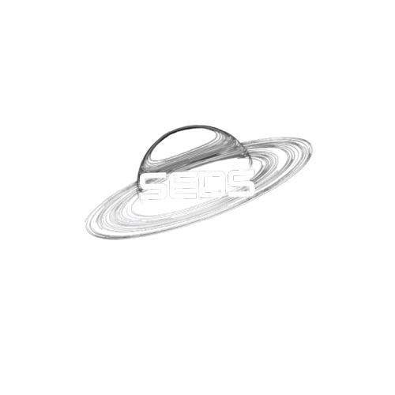

# SEDS - REC Website

## Students for the Exploration and Development of Space - REC Chapter

A modern, interactive website for the SEDS (Students for the Exploration and Development of Space) chapter at Rajalakshmi Engineering College.



## 🚀 Features

### Hero Section
- **Full-screen background video** (`herovid.mp4`) for immersive experience
- **Modern overlay navigation** with glassmorphism design
- **Arsenal font typography** for distinctive branding
- **Animated scroll indicator** to guide user interaction
- **Responsive design** optimized for all devices

### Navigation System
- **Overlay menu** with smooth slide-in animations
- **Split-screen layout**: Logo on left, navigation on right
- **Navigation links**: About, Events, Team, Contact
- **Social media integration**:
  - 📧 Email: [sedsrec@rajalakshmi.edu.in](mailto:sedsrec@rajalakshmi.edu.in)
  - 📸 Instagram: [@seds_rec](https://www.instagram.com/seds_rec/?hl=en)
  - 💼 LinkedIn: [SEDS-REC Company Page](https://www.linkedin.com/company/seds-rec/posts/?feedView=all)

### Design Highlights
- **Glassmorphism UI** with backdrop blur effects
- **Smooth animations** and micro-interactions
- **Professional typography** using Google Fonts (Arsenal)
- **Modern CSS** with Tailwind CSS framework
- **Accessibility-focused** design patterns

## 🛠️ Technology Stack

- **Framework**: Next.js 15 (React 19)
- **Styling**: Tailwind CSS
- **Typography**: Google Fonts (Arsenal, Geist)
- **Language**: TypeScript
- **Package Manager**: npm

## 📁 Project Structure

```
seds/
├── public/
│   ├── logo.png          # SEDS logo
│   ├── herovid.mp4       # Background video
│   └── ...               # Other assets
├── src/
│   └── app/
│       ├── globals.css   # Global styles
│       ├── layout.tsx    # Root layout with fonts
│       └── page.tsx      # Main homepage component
├── package.json          # Dependencies
└── README.md            # This file
```

## 🚀 Getting Started

### Prerequisites
- Node.js 18+ installed
- npm or yarn package manager

### Installation

1. Clone the repository:
```bash
git clone https://github.com/Krishcodes-awesomestuff/portfolio.git
cd seds
```

2. Install dependencies:
```bash
npm install
```

3. Run the development server:
```bash
npm run dev
```

4. Open [http://localhost:3000](http://localhost:3000) in your browser

### Build for Production

```bash
npm run build
npm start
```

## 🎨 Design Philosophy

The website embodies the spirit of space exploration through:

- **Modern Aesthetics**: Clean, futuristic design reflecting technological advancement
- **Interactive Elements**: Engaging animations that capture user attention
- **Professional Branding**: Consistent use of SEDS branding and typography
- **User Experience**: Intuitive navigation and clear information hierarchy
- **Performance**: Optimized for fast loading and smooth interactions

## 📱 Responsive Design

The website is fully responsive and optimized for:
- 📱 Mobile devices (320px+)
- 📲 Tablets (768px+)
- 💻 Desktops (1024px+)
- 🖥️ Large screens (1440px+)

## 🔧 Development

### Key Components

- **Hero Section**: Full-screen video background with centered branding
- **Navigation**: Overlay menu system with smooth transitions
- **Typography**: Arsenal font for distinctive space-tech aesthetic
- **Animations**: CSS animations and transitions for enhanced UX

### Customization

To customize the website:

1. **Update branding**: Replace `logo.png` in the `public` folder
2. **Change video**: Replace `herovid.mp4` with your background video
3. **Modify content**: Edit text content in `src/app/page.tsx`
4. **Update links**: Change social media URLs in the navigation component

## 🌟 About SEDS

Students for the Exploration and Development of Space (SEDS) is an international student organization whose purpose is to promote space as a career field and to stimulate student interest in space science, engineering, and exploration.

### SEDS - REC Chapter

The Rajalakshmi Engineering College chapter of SEDS is dedicated to:
- Promoting space science education
- Organizing space-related events and workshops
- Building a community of space enthusiasts
- Encouraging careers in aerospace and related fields

## 📞 Contact

For questions about this website or SEDS - REC:

- **Email**: sedsrec@rajalakshmi.edu.in
- **Instagram**: [@seds_rec](https://www.instagram.com/seds_rec/?hl=en)
- **LinkedIn**: [SEDS-REC](https://www.linkedin.com/company/seds-rec/posts/?feedView=all)

## 📄 License

This project is part of the SEDS - REC portfolio and is intended for educational and organizational purposes.

---

**Built with ❤️ by the SEDS - REC team**

*Reaching for the stars, one line of code at a time* 🚀